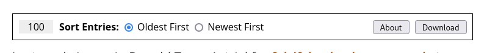
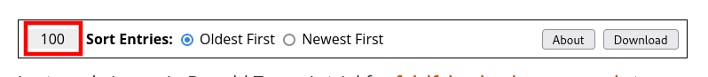

# dk-sort

[Browser extension][] which makes the following changes to [Daily Kos][]
live update articles:

1. Sort the entries in chronological (that is, readable) order by default.
2. Add a toolbar which allows you to edit the entry sort order and also
   download the entries as a [CSV][] file.

Screenshot:

These changes are only made for live update articles; regular [Daily
Kos][] articles are unaffected.

## Basic Use

Use the "Oldest First" and "Newest First" radio buttons to select the
sort order.  Use the "Download" button to download all live update
entries as a [CSV][] file.

Below is a brief description of each toolbar component.

### Entry Counter

Count of the total number of live update entries on this page.

### Sort Mode Buttons

Sort order for live update entries on this page.  The available sort
modes are:

- "Oldest First": Sort live update entries from oldest to newest.  This
  is the default selection.
- "Newest First": Sort live update entries from newest to oldest.

### About Button

Click this button to show a brief explanation of the tool.

### Download Button

Click this button to show a brief explanation of the tool.

## Notes

- Currently only tested in [Firefox][], but should work in Chrome too.
- Icon borrowed from [Bootstrap Icons][]
- This extension was originally a [bookmarklet][]; the original source is
  available here: <https://pmdn.org/dk-sort.txt>.

## License

Copyright 2024 Paul Duncan

Permission is hereby granted, free of charge, to any person obtaining a
copy of this software and associated documentation files (the
"Software"), to deal in the Software without restriction, including
without limitation the rights to use, copy, modify, merge, publish,
distribute, sublicense, and/or sell copies of the Software, and to
permit persons to whom the Software is furnished to do so.

THE SOFTWARE IS PROVIDED "AS IS", WITHOUT WARRANTY OF ANY KIND, EXPRESS
OR IMPLIED, INCLUDING BUT NOT LIMITED TO THE WARRANTIES OF
MERCHANTABILITY, FITNESS FOR A PARTICULAR PURPOSE AND NONINFRINGEMENT.
IN NO EVENT SHALL THE AUTHORS OR COPYRIGHT HOLDERS BE LIABLE FOR ANY
CLAIM, DAMAGES OR OTHER LIABILITY, WHETHER IN AN ACTION OF CONTRACT,
TORT OR OTHERWISE, ARISING FROM, OUT OF OR IN CONNECTION WITH THE
SOFTWARE OR THE USE OR OTHER DEALINGS IN THE SOFTWARE.

[browser extension]: https://en.wikipedia.org/wiki/Browser_extension
  "Web browser extension."
[Daily Kos]: https://dailykos.com/
  "dailykos.com"
[csv]: https://en.wikipedia.org/wiki/Comma-separated_values
  "Comma-separated value (CSV)"
[bootstrap icons]: https://icons.getbootstrap.com/
  "Bootstrap Icons"
[bookmarklet]: https://en.wikipedia.org/wiki/Bookmarklet
  "Bookmark that contains JavaScript which adds new browser features."
[firefox]: https://mozilla.org/firefox/
  "Firefox web browser"
